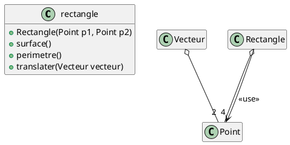
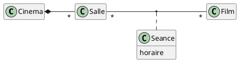
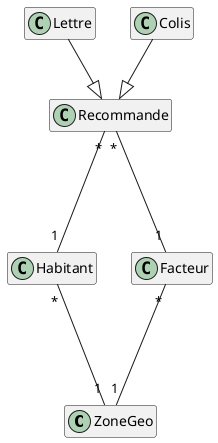

# Exercice : 2
Dessiner les diagrammes de classe correspondant aux différents énoncés suivants :

1.Tout écrivain a écrit au moins une oeuvre;
Une oeuvre est écrit par un seul auteur.

```plantuml
hide empty member
left to right direction    
class Auteur
class Oeuvre

Auteur "1" -- "1..+" Oeuvre : a écrit >

```

2.Les personnes peuvent être associées à des universités en tant qu’étudiants aussi bien qu’en tant que professeurs;

```plantuml
hide empty member
left to right direction    
class Personne
class Université

Personne "*" -- "1" Université : est inscrit >
Personne <|-up- Etudiant
Personne <|-up- Professeur
```


3. Un raccourci concerne un fichier ou un répertoire;

```plantuml
hide empty member
left to right direction    
class Racourci{}

class Fichier{}

class Repertoire{}

racourci -- "1" Repertoire
racourci -- "1" Fichier
```

4. Un rectangle a quatre sommets qui sont des points. On construit un rectangle à partir des coordonnées de deux
points. Il est possible de calculer sa surface et son périmètre, ou encore de le translater selon un vecteur qui
est caractérisé par deux points;



5. Les cinémas sont composés de plusieurs salles qui projettent des films à une heure déterminée;



6. Tous les jours, le facteur distribue des recommandés dans uns zone géographique qui lui est affectée. Les
habitants sont aussi associés à une zone géographique. Les recommandés sont de deux sortes : lettres ou colis.
Comme plusieurs facteurs peuvent intervenir sur la même zone, on souhaite, pour chaque recommandé, le
facteur qui l’a distribué, en plus du destinataire.

