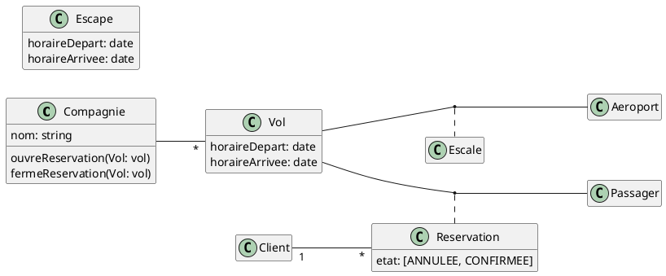

Exercice 3 : Soit la description d’un système de réservation de vol suivante :
1. Une compagnie propose plusieurs vols;
2. Un vol est ouvert à la réservation et refermé sur ordre de la compagnie;
3. Un client peut réserver un ou plusieurs vols, pour des passagers différents;
4. Une réservation concerne un seul vol et un seul passager;
5. Une réservation peut être annulée ou confirmée;
6. Un vol a un aéroport de départ et un aéroport d’arrivée;
7. Un vol a un jour et une heure de départ, et un jour et une heure d’arrivée;
8. Un vol peut comporter des escales dans des aéroports;
1
9. Une escale a une heure d’arrivée et une heure de départ;
10. Chaque aéroport dessert une ou plusieurs villes dans son voisinage.
Représentez le modèle de domaine du système sous forme d’un diagramme de classes (noms et attributs uniquement pour les différentes classes).

