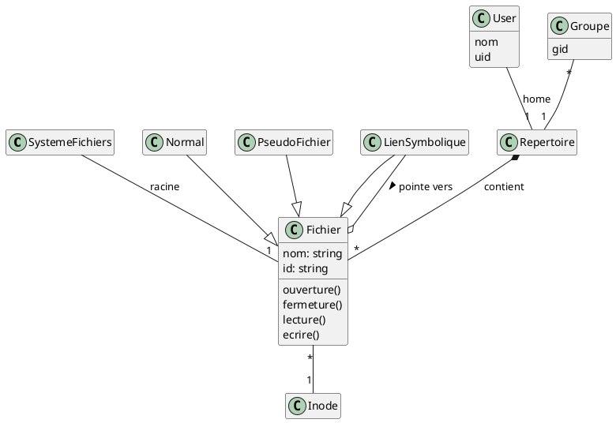

Exercice 4 : Un système de fichier est un ensemble de fichiers contenus dans un répertoire racine. Il y a au plus
un répertoire racine par système de fichiers. Les répertoires sont des types particuliers de fichiers. Un fichier est
toujours désigné par un nom. Il possède un unique inode. Un fichier possède les fonctionnalités suivantes : ouverture,
fermeture, lecture, écriture. Il existe plusieurs sortes de fichiers : les fichiers normaux, les répertoires, les liens
symboliques, les pseudo-fichiers. Un répertoire peut contenir plusieurs fichiers. Un lien symbolique fait référence à
(“pointe vers”) un autre fichier. Chaque fichier est associé à un unique inode qui contient différentes informations
(qu’il n’est pas important de détailler ici). Un utilisateur peut posséder un ou plusieurs fichiers et possède au plus un
répertoire “home”. Un inode ne peut être possédé que par un seul utilisateur. Un utilisateur appartient à au moins un
groupe. Un utilisateur est repéré par identifiant d’utilisateur (UID) et un groupe (GID) par un identifiant de groupe.
Représentez le modèle de domaine du système sous forme d’un diagramme de classes (noms et attributs uniquement pour les différentes classes).

