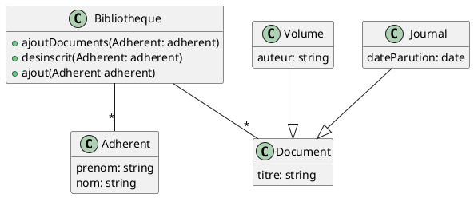

Exercice 1 : On désire automatiser la gestion d’une petite bibliothèque municipale. Pour cela, on a analysé son
fonctionnement pour obtenir la liste suivante de règles et d’affirmations :
1. Les adhérents ont un prénom (chaîne de caractères) et un nom (chaîne de caractères);
2. La bibliothèque comprend un ensemble de documents et un ensemble d’adhérents;
3. Les adhérents sont inscrits ou désinscrits sur une simple demande;
4. De nouveaux documents sont ajoutés régulièrement à la bibliothèque;
5. Ces documents sont soit des journaux, soit des volumes;
6. Les volumes sont soit des livres, soit des BD;
7. Les documents sont caractérisés par un titre (chaîne de caractères);
8. Les volumes ont en plus un auteur (chaîne de caractères);
9. Les Bd ont en plus un nom de série (chaîne de caractères);
10. Les journaux ont, outre les caractéristiques des documents, une date de parution (une date);
11. Seuls les livres sont empruntables;
12. Un adhérent peut emprunter ou restituer un livre;
13. Les adhérents peuvent emprunter des livres (et uniquement des livres) et on doit pouvoir savoir à tout moment
quels sont les livres empruntés par un adhérent;
14. Un adhérent peut emprunter au plus 3 livres;
15. La date de restitution d’un livre emprunté est fixée au moment du prêt. Cette date peut être prolongée sur
demande.
Identifiez les classes et réalisez le diagramme de classes correspondant.

