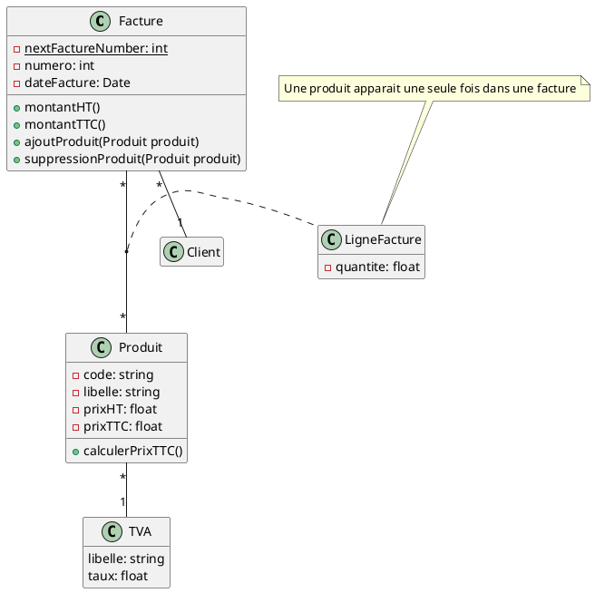

Exercice 2 : L’étude de la gestion de la facturation dans une entreprise a permis de dégager les règles de gestion
suivantes :
1. Les factures sont numérotées et datées;
2. Chaque facture fait apparaître un certain nombre de produits. Une quantité est associée à chacun des produits
d’une facture;
3. Un produit est désigné par un code et un libellé permet de l’identifier de manière plus claire;
4. On doit connaître les prix hors taxe des produits. Le montant TTC est calculé;
5. La TVA applicable à chaque produit dépend de son type. Pour chaque type de produit, on connaît le libellé et
le taux de TVA associé;
1
6. Les factures ne doivent pas concerner plusieurs clients;
7. On doit pouvoir calculer le montant TTC et le montant HT des factures;
8. On doit pouvoir ajouter et supprimer des produits à une facture. Ce sont d’ailleurs les deux seuls moyens de
modifier le contenu d’une facture. En outre, si on ajoute un produit déjà existant à une facture, on augmente
simplement la quantité du produit concerné.
Donnez un diagramme de classes permettant de représenter ces informations.

