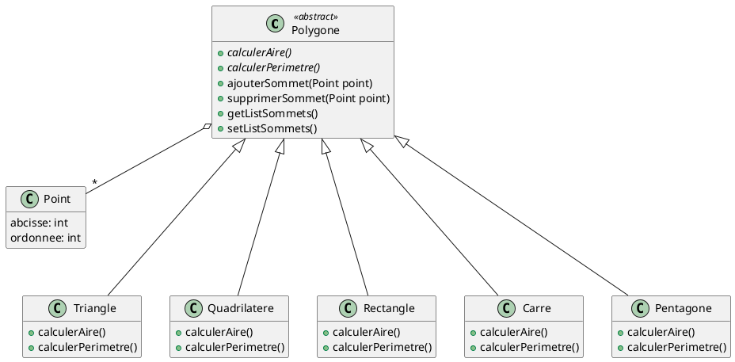

Exercice 3 : Dans le domaine de la géométrie à deux dimensions, nous nous intéressons aux différentes formes
géométriques sur le plan cartésien. Parmi elles, on trouve les polygones convexes standards, par exemple, le triangle,
le quadrilatère, le rectangle, le carré, le pentagone, etc. Chaque polygone possède un ensemble de sommets (des
points sur le plan), composés de deux coordonnées réelles (abcisse et ordonnée). Chaque polygone est capable
de calculer son aire et son périmètre, en plus de modifier ou retourner son ensemble de sommets. Fournissez un
diagramme de classes décrivant la structure interne d’un système basée sur tel domaine.

