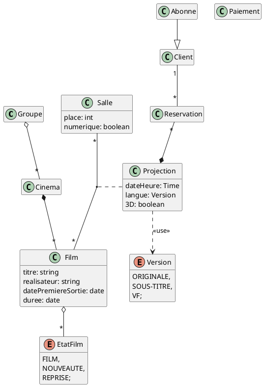

Exercice 4 : Une grande chaîne de cinémas veut mettre en place un nouveau système de réservation de places
de cinéma pour la France. Le groupe exploite des cinémas à travers toute la France. Chaque cinéma projette un
certain nombre de films, des nouveautés ou des reprises. Un film est identifié par son titre, son réalisateur, sa date de
première sortie et sa durée. Dans un cinéma donné, un film est projeté dans une salle contenant un certain nombre de
places, à une date et une heure données, en version originale sous-titrée ou en version française. Selon l’équipement
de la salle, la projection est analogique ou numérique. Un film peut également être projeté en 3D mais uniquement
dans une salle ayant un équipement de projection numérique.
Les clients du système de réservation peuvent réserver une ou plusieurs places pour une séance d’un film dans
un cinéma donné. Le client peut payer par carte bancaire les places réservées au moment de la réservation ou utiliser
sa carte d’abonné s’il en possède une (identifiée par un numéro et une date de fin de validité). Un abonnement est
payé pour un an et permet un nombre de séances illimité pour l’abonné pendant cette période. Un abonné ne peut
pas réserver une place pour quelqu’un d’autre que lui sur sa carte. Il devra justifier à l’entrée du cinéma de son statut
d’abonné. Il peut par contre réserver plusieurs places pour une séance mais il devra payer pour les autres places que
la sienne.
Le prix d’une place est fixé par le cinéma, ainsi que le supplément pour les projections 3D lorsque le cinéma est
équipé. Le prix d’une réservation sera calculé à partir du prix des places dans le cinéma, de la nature de la séance
(3D ou non), du nombre de places réservées pour cette séance et de l’utilisation d’une carte d’abonnement (une
place gratuite).
Donner un diagramme de classes pour ce système de réservation.

